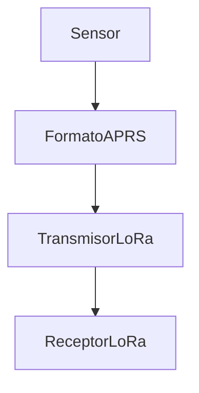
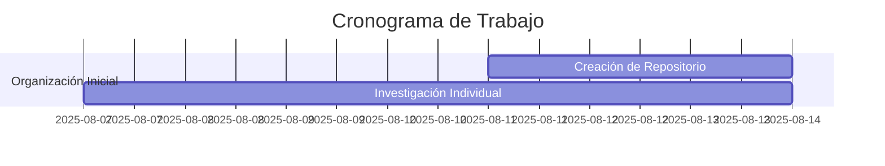

# Proyecto - Taller Integrador - EL5610

En este repositorio se realiza el desarrollo de **firmware** para un módulo *tracker* con la placa de desarrollo **LilyGo's T-Beam ESP32 LoRa 433MHz SX1276** por los estudiantes: 
- `Nagel Mejía Segura`
- `Óscar González Cambronero`
- `Wilberth Gutiérrez Montero`

## Table of Contents
1. [Conceptos Teoricos](#conceptos-teoricos)
    - [APRS](#aprs)
    - [LoRa](#lora)
    - [Legislación Costarricense](#legislación-costarricense)
2. [Estructura de Directorios](#estructura-de-directorios)
3. [Diagrama de Flujo](#diagrama-de-flujo)
4. [Construcción](#construcción)
    - [Ejemplos](#ejemplos-lilygo)
5. [Agradecimientos](#agradecimientos)
6. [Fuentes de Información](#fuentes-de-información)
7. [Cronograma](#cronograma-de-trabajo)

## Conceptos Teoricos

### APRS

**APRS** **`(Automatic Packet Reporting System)`** es un protocolo en tiempo real utilizado por radioaficionados. Originalmente creado para la localización de objetos moviles, fue diseñado por Bob Bruninga.

#### Detalles Tecnicos de APRS

- **Función Principal:** El objetivo principal de APRS es organizar el formato de los datos a enviar.
- **Capa de Enlace:** En la capa de enlace utiliza AX.25
- **Bandas de Frecuencia:** VHF (30 - 300 MHz), generalmente alrededor de 144 MHz.
- **Internet (APRS-IS):** Por medio de un IGate se pueden recibir paquetes de APRS, y enviarlos por APRS-IS.

---

### LoRa

**LoRa** **`(Long Range)`** es una tecnica de modulación de RF, diseñada y registrada por la empresa Samtech. Tiene la caracteristica de alcanzar largas distancias 5 km en areas urbanas y 15 km en areas rurales en linea vista, además de ser de baja potencia

#### Detalles Tecnicos de LoRa

- **Función Principal:** Mover fisicamente los paquetes de APRS.
- **Modulación:** CSS (Chirp Spread Spectrum) Barrido de frecuencias para ensanchar el espectro
- **Bandas de Frecuencia:** Bandas ISM (433 MHz - 915 MHz).

---

### Legislación Costarricense

| Tipo        | APRS                               | LoRa                            |
|-------------|------------------------------------|---------------------------------|
| Permisos    | Requiere licencia radioaficionados | Uso Libre`*`                    |
| Frecuencias | 144.39 MHz                         | 433.05–434.79 MHz 920.5–928 MHz |
| Potencia    | Novicio 200 W                      | PIRE = 30 dBm `**`              |

> [!NOTE]
> `*` Se deben de respetar los limites permitidos en el PNAF.
>
> `**` La potencia de salida de la antena es 24 dBm. El PIRE puede llegar a 36 dBm si la potencia de la antena es de 30 dBm.  

---

## Estructura de Directorios

```
Estructura
├── documentacion/               - Reportes, Avances, Bitacoras 
├── extra/                       - Ejemplos extra para ESP32
|    ├── lib                     - Contiene librerías propias de LilyGo, obtenido externamente.
|    └── ejemplos_lily           - Contiene código fuente de ejemplos propios de LilyGo, obtenido externamente.
├── firmware/                    - Firmware general del sistema
└── README.md
```

## Diagrama de Flujo 




## Construcción

### Ejemplos LilyGo


## Agradecimientos

A Ricardo Guzman (CA2RXU) por su repositorio en el cual se baso el proyecto

Enlace del Repositorio: https://github.com/richonguzman/LoRa_APRS_Tracker 


## Fuentes de Información
Librerías propias, el archivo `plaformio.ini` y varios fueron obtenidos de:

[Repositorio de LilyGo-LoRa-Series](https://github.com/Xinyuan-LilyGO/LilyGo-LoRa-Series/tree/master)

Se requiere únicamente descomentar el ejemplo correspondiente en `platformio.ini`, construir y programar con las herramientas de *Platformio*.

## Cronograma de Trabajo

